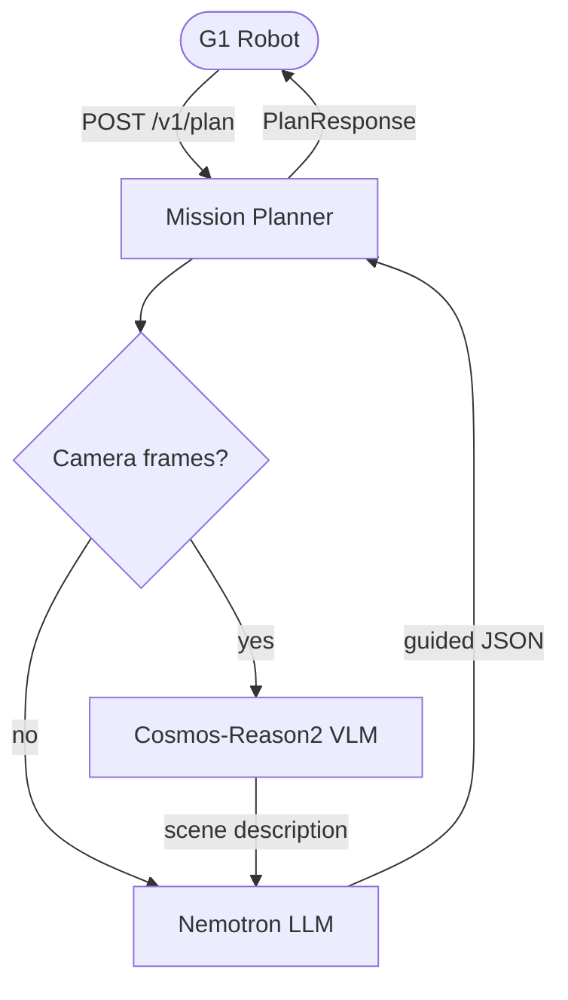

# Mission Planner

Cloud mission planning service for the Unitree G1 humanoid robot. Orchestrates NVIDIA Cosmos-Reason2 (vision-language model) for scene understanding and Nemotron (LLM) for mission planning, producing structured action waypoints from natural language tasks.

> [!NOTE]
> This project was developed with assistance from AI tools.

## How It Works

The robot client calls `POST /v1/plan` at low frequency (0.25–1 Hz) with its current pose and optionally one or more camera frames. The service chains two models and returns an ordered list of waypoints the robot can execute.



## Integration Contract

Each action in the response uses a flat structure matching the robot operator's `Waypoint` dataclass. The `description` field is for downstream VLA (GR00T) consumption — the VLA uses it for semantic reasoning about each action.

```json
{
  "request_id": "a1b2c3d4e5f6",
  "plan_id": "c7d8e9f0",
  "timestamp": "2026-04-08T14:30:00+00:00",
  "ttl_seconds": 300,
  "frame_id": "world",
  "actions": [
    {
      "action_id": "approach_stairs",
      "x": 5.0,
      "y": 0.0,
      "z": 0.0,
      "yaw": 0.0,
      "behavior": "walk",
      "on_arrive": null,
      "description": "Walk across flat floor to the base of the podium stairs"
    }
  ],
  "scene_description": "Indoor conference room, 12m x 10m...",
  "replan_conditions": [
    {"condition": "Stairs blocked", "action_id": "climb_podium"}
  ],
  "planning_notes": "debug-only LLM reasoning"
}
```

**Key fields for robot integration:**

| Field | Type | Values |
|-------|------|--------|
| `behavior` | string | `walk`, `climb`, `descend`, `stand` |
| `on_arrive` | string or null | `handshake`, `wave`, `grasp`, `release` |
| `x`, `y`, `z` | float | Meters in world frame |
| `yaw` | float | Radians |
| `timestamp` | ISO 8601 datetime | Plan creation time (UTC) |
| `ttl_seconds` | int | Plan validity window in seconds |
| `replan_conditions` | array | Forward-looking — not yet consumed by the robot client |

## API Endpoints

| Method | Path | Description |
|--------|------|-------------|
| POST | `/v1/plan` | Generate a mission plan (with optional camera frames) |
| POST | `/v1/scene` | Scene understanding only (requires at least one camera frame) |
| GET | `/v1/health` | Readiness — checks model connectivity (returns 503 when unhealthy) |
| GET | `/v1/health/live` | Liveness — always returns 200 |
| GET | `/v1/models` | Configured models and their availability |
| GET | `/metrics` | Prometheus metrics |

## Quick Start

```bash
# Install dependencies + dev tools
make install

# Run with mock model server (no GPU needed)
make run-mock

# Run tests
make test

# Lint (auto-fixes and formats)
make lint
```

Pre-commit hooks run lint + tests on every commit. They are installed automatically via `pre-commit install` after `make install`.

## Configuration

Environment variables (see `.env.example`):

| Variable | Default | Description |
|----------|---------|-------------|
| `COSMOS_ENDPOINT` | `http://cosmos-reason2-metrics:8080/v1` | Cosmos-Reason2 OpenAI-compatible endpoint |
| `COSMOS_MODEL` | `cosmos-reason2` | Served model name for scene understanding |
| `NEMOTRON_ENDPOINT` | `http://nemotron-metrics:8080/v1` | Nemotron OpenAI-compatible endpoint |
| `NEMOTRON_MODEL` | `nemotron` | Served model name for planning |
| `LOG_LEVEL` | `info` | Logging level |
| `REQUEST_TIMEOUT` | `30.0` | Model request timeout in seconds |
| `PLAN_TTL_SECONDS` | `300` | Plan validity window in seconds |

## Deployment

Built for OpenShift with Kustomize. The deployment runs as non-root with restricted-v2 SCC-compliant security context.

```bash
# Build and push container image
make push

# Deploy to OpenShift
make deploy

# Tear down
make undeploy
```

Image registry defaults to `quay.io/jary/mission-planner:latest`. Override with:

```bash
make push IMAGE_REGISTRY=quay.io IMAGE_ORG=myorg IMAGE_TAG=v0.1.0
```
